<p align="center">
  
  
  
  
</p>


## OpenWSH-CONTROL 🌍

A comprehensive, full-stack analytics and processing prototype designed for the Water, Sanitation, and Hygiene (WASH) sector. OpenWSH-CONTROL provides technical teams, directors, and researchers with autonomous RFP data extraction, macro-indicator context fetching, systems strengthening recommendations, an integrated climate prediction engine, and real-time multiplayer system modeling.

🔗 Live Deployment: https://wash-rfp-frontend.vercel.app


## 🌟 Key Features

## 📥 Autonomous Data Extraction

Intelligent RFP Parser: Streamlines tender ingestion by uploading PDFs directly for high-speed metadata extraction.

Unified Workspace Sheet: Once processed, the interface automatically transitions from split-grids into an integrated, top-to-bottom master results sheet, facilitating single-click clipboard copies of parsed requirements.

Global State Pipeline: Sanitized geographical and programmatic data from the parsed document is dynamically injected into the root state, auto-populating downstream modules.

## 📊 Climate & Context Analytics

Live Context Engine (The Oracle): Evaluates selected jurisdictions to fetch dynamic Water Stress and Governance metrics from local telemetry stores, using algorithmic fallbacks to guarantee 100% service uptime during live evaluations.

Monte Carlo Simulator: Projects probability curves and estimates climate-related program volatility risks over a 10-year planning window.

## 👥 Collaborative Systems Modeler

Multiplayer State Sync: Provides a collaborative workspace focused on institutional assessments. Adjusting sliding controls (representing Policy, Finance, and Infrastructure capacity) triggers immediate baseline adjustments.

WebSocket Integration: Uses secure FastAPI WebSocket connections to broadcast workspace parameter changes to all active operators in real time.

## 📋 Master Analysis Report

Audit-Ready Aggregator: Consolidates all extracted parameters, environmental baselines, and modeling metrics into an extensive, printable layout designed to satisfy institutional compliance and reporting guidelines.

## 🗺️ GeoJSON Ingestion: 

GeoJSON map addition: Implements a native FileReader pipeline allowing real-time rendering of custom boundary shapefiles and borehole networks directly onto the dashboard. Project later migrated from a static marker-based component to an interactive React-Leaflet GIS workspace.

## 🪵 LogFrame Matrix Engine: 

Develops a new dedicated workspace (/logframe) that generates an automated, audit-ready logical framework matrix based on parsed RFP metadata.


## 🏗️ Technical Architecture

Client-Side Data Pipeline & Global Memory

Data flow integrity is maintained via a unidirectional state cascade established at the root component (App.tsx), acting as a local data pipeline.

The root pipeline governs three active state vectors:

uploadedDocument (Identifier tracking the current raw file)

liveContext (Active macro-indicator telemetry)

extractedRfp (Extracted metadata and geographic targets)

When a document is parsed, setExtractedRfp updates the global coordinate system. Downstream systems, like the ClimatePredictor, observe this transition, locking their queries and executing auto-fetch operations with zero manual operator intervention.


## Persistent State & Session Cache

To prevent loss of critical data during navigation shifts, page refreshes, or browser tab changes, the client-side system uses a dual-layer state synchronization model:

Components write state updates directly to browser SessionStorage (rfpParsedData, cp_state).

Upon mounting, lifecycle hooks check the cache to decode and hydrate the interface.

An explicit "Reset" control is exposed to clear cached states on demand without disrupting core pipeline variables.


## 💻 System Requirements

Frontend Build Engine: Node.js v18+ (utilizing npm or yarn package managers)

Backend Runtime: Python v3.9+ (utilizing pip and virtual environments)

AI Processing Keys: Active access to the Google Gemini API (or compatible AI model engines)


## 🚀 Installation & Setup

OpenWSH-CONTROL uses a decoupled architecture. For clean organization, we place both the frontend client folder and the backend server folder inside a unified master workspace directory.

1. Clone the Repository

Clone the frontend application directory to your local workstation:

git clone 
```bash
https://github.com/GideonLartey/wash-rfp-frontend.git
```


2. Frontend Local Installation

Open a terminal window and navigate into the newly cloned client folder:

```bash
cd wash-rfp-frontend
npm install
```


3. Environment Configuration

Create a .env file in the root of the wash-rfp-frontend directory. You can use the provided .env.example as a template:

```bash
VITE_API_URL=http://localhost:8000
```

(Point this URL to your local Python server address during local development).

4. Run the Client Development Server

```bash
npm run dev
```


## 📝NOTE:AI API Usage & Cost Optimization

To manage API consumption during the development and prototyping phase, the LogFrame Matrix and Climate Predictor component currently utilizes a structured mock-data. This ensures high-velocity testing of the UI/UX components without incurring unnecessary API token costs. The production-ready backend is already engineered to route these requests to the Gemini 2.5 Flash model for dynamic, RFP-specific output once you decide to deploy in a production environment with a configured billing tier.

To prevent abuse of the system by bad actors, we implemented slowapi rate limiting in the backend(main.py) file:

- **get_remote_address**: 
This automatically identifies unique users based on their IP address.

- **request: Request**: 
The limiter needs this to read the incoming connection details.

- **The "429" Error**: 
If a user hits the button 6 times in a minute, the server won't crash or run up your AI bill. Instead, FastAPI will automatically reject the 6th request and send a clean HTTP 429 (Too Many Requests) status code back to your Next.js frontend.


## 😒 Project Constraints( Weird behaviour of the Monte Carlo Simulator line curve in batch PDFexport )

During the batch PDF generation process, the platform handles high-density histogram rendering from the Monte Carlo simulator window very well. However, line curves may produce unusual and weird behaviour. Switch to the histogram view before export. I will actively work on this to get it working at full capacity.


## 📂 Project Structure

```bash
OpenWsh-Control/
├── backend/
│   ├── main.py
│   ├── requirements.txt
│   ├── venv/
│   └── .gitignore
└── frontend/
    ├── node_modules/                          
    ├── public/
    │   ├── favicon.svg
    │   └── icons.svg
    ├── src/
    │   ├── assets/
    │   ├── components/
    │   │   ├── Layout.tsx                          
    │   │   ├── DataDrillDown.tsx
    │   │   └── GisMapNode.tsx
    │   ├── pages/
    │   │   ├── ClimatePredictor.tsx
    │   │   ├── ConsortiumMatrix.tsx
    │   │   ├── Dashboard.tsx
    │   │   ├── EvidenceEngine.tsx
    │   │   ├── LogFrameMatrix.tsx
    │   │   ├── Login.tsx
    │   │   ├── MasterReport.tsx
    │   │   ├── MonteCarloSimulator.tsx
    │   │   ├── RfpParser.tsx
    │   │   └── SystemsModeler.tsx
    │   ├── App.tsx
    │   ├── index.css
    │   └── main.tsx
    ├── .gitignore
    ├── eslint.config.js
    ├── index.html
    ├── LICENSE
    ├── package-lock.json
    ├── package.json
    ├── README.md
    ├── tsconfig.app.json
    ├── tsconfig.json
    ├── tsconfig.node.json
    └── vite.config.ts
```


## System Architecture


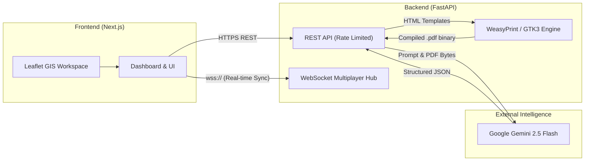


## 📸 Application Preview

## overview & rfpParser

<p align="center">
  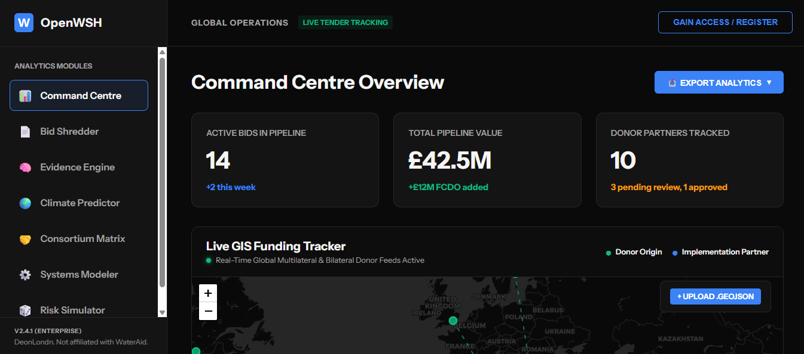
  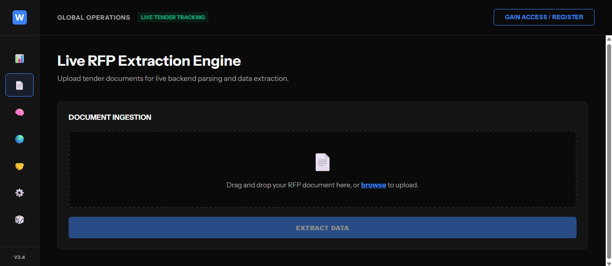
</p>

## climatePredictor & evidenceEngine

<p align="center">
  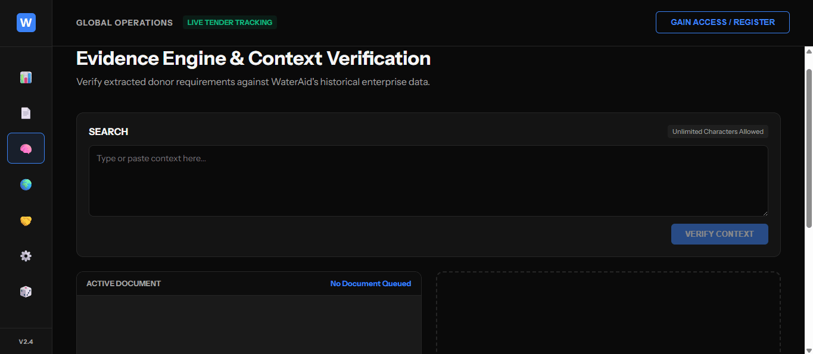
  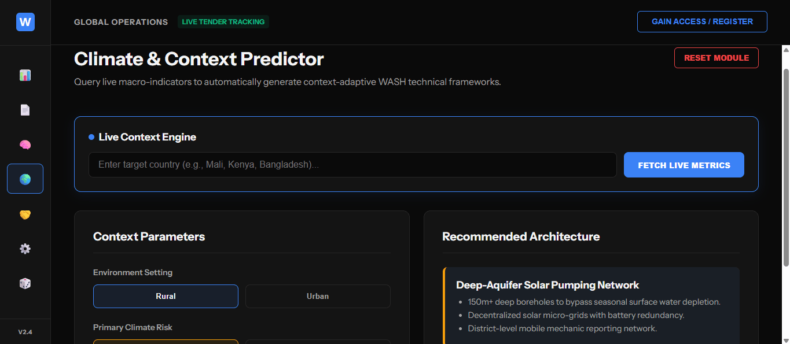
</p>

## consortiumMatrix & systemsModeler

<p align="center">
  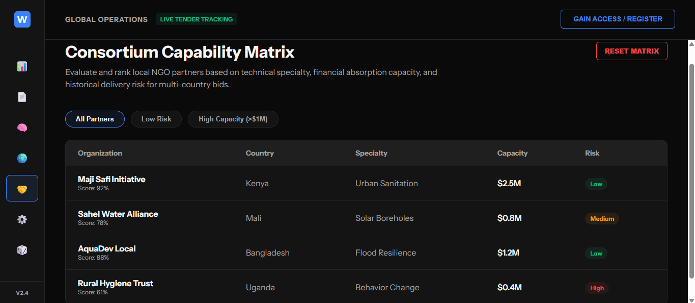
  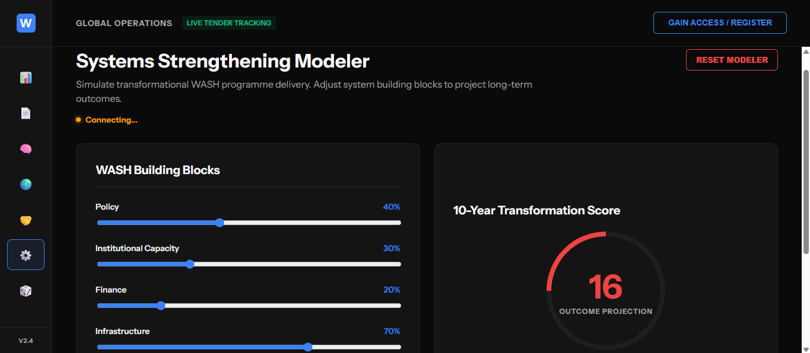
</p>

## livetracker & monteCarloSimulator
<p align="center">
  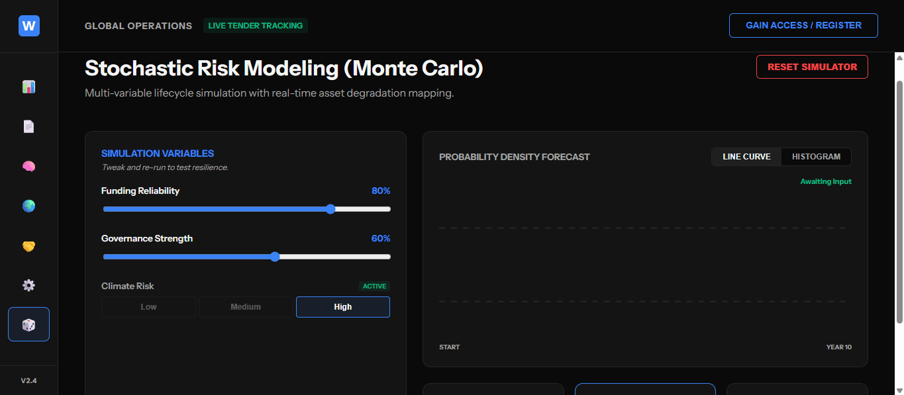
  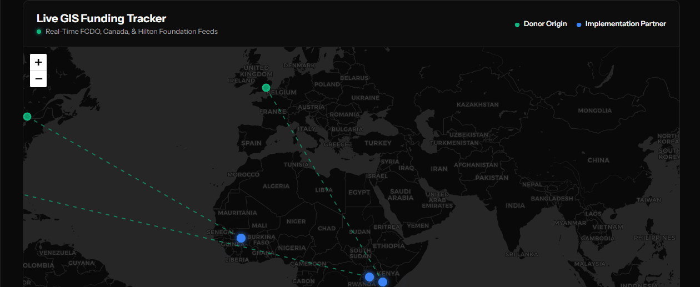
</p>

## logFrameMatrix & samplebatchdownload
<p align="center">
  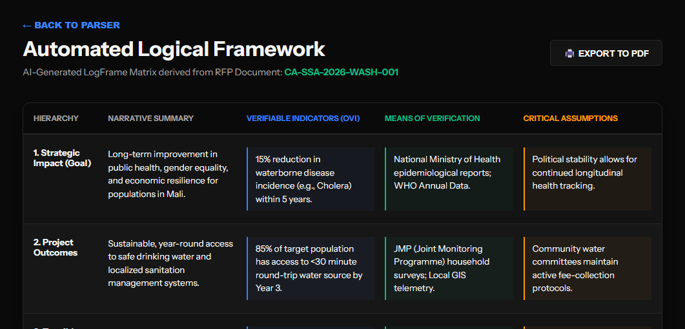
  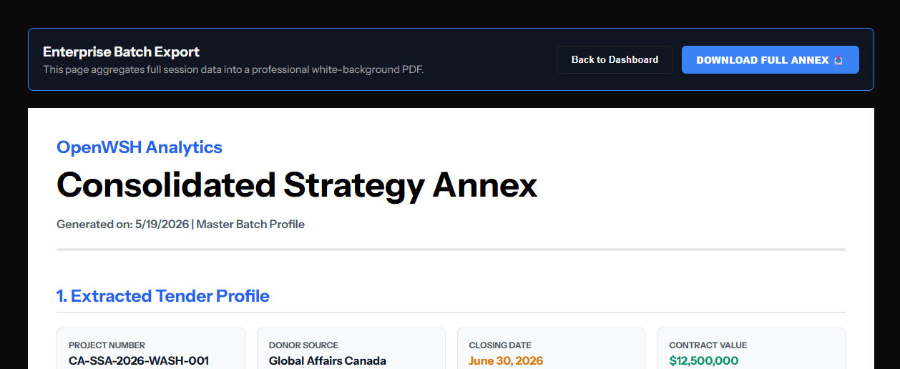
</p>


## 🗺️ Future Enhancements

Persistent Storage: Integrate a PostgreSQL database cluster to manage and secure multi-user persistent workspaces.

Optimized Cache Layers: Incorporate a Redis memory database in the API layer for high-speed, localized query caching.

Live Donor Telemetry: Replace mock dictionaries with dynamic HTTP queries linked directly to official global donor data APIs.


## 📄 License & Authors

Developer: Gideon Lartey (DeonLondn)

Last Code Optimization: May 2026

This project is open-source and released under the terms of the MIT License—see your local LICENSE file for precise terms.


## ⚖️ Disclaimer

This is an independent systems prototype built strictly for technical demonstration and educational purposes. It is not associated, affiliated, endorsed, or partnered in any way with WaterAid, or any organization, interest, subsidiary, or entity connected to the official WaterAid organization.


